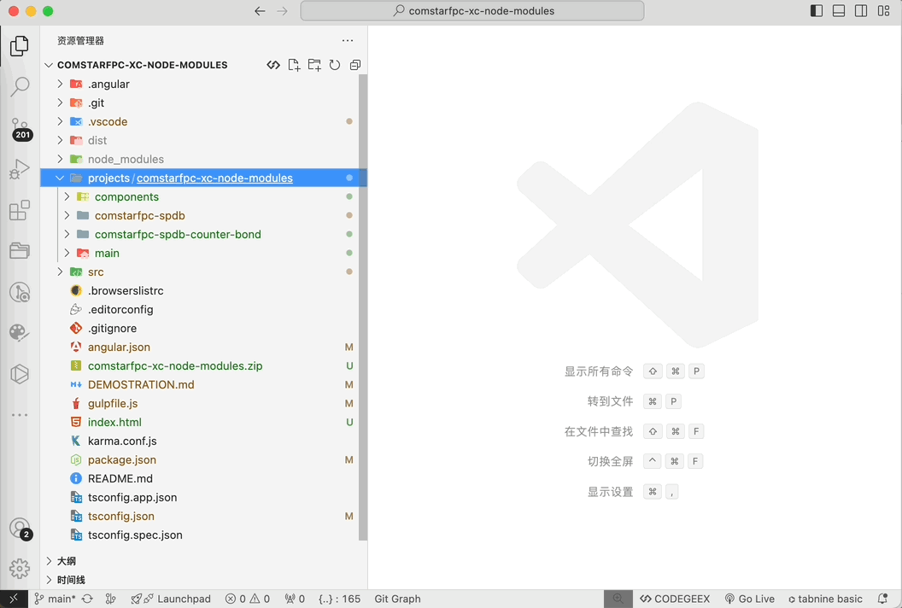
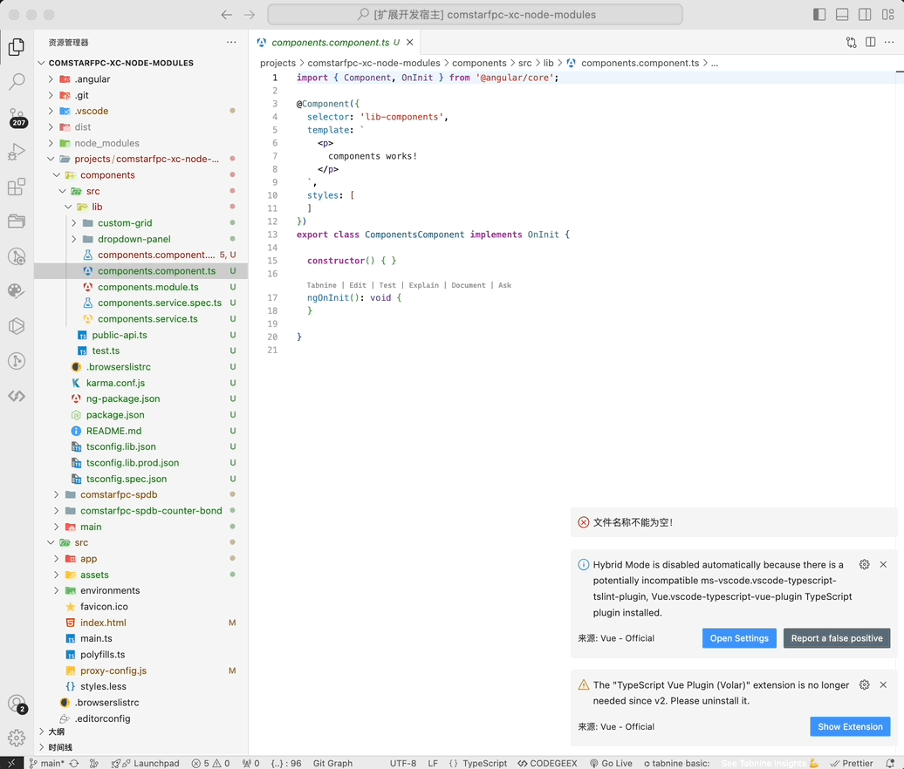

# ng-menus

**ng-menus** 是一个 VSCode 插件，旨在帮助开发者快速生成 Angular 文件，简化 Angular 项目的文件创建过程。通过右键菜单，你可以直接在指定目录下生成组件、指令、服务等 Angular 文件，无需手动输入命令行。

## 功能

> 所有功能需要在ng-cli环境下使用，且仅支持在Angular项目目录中使用。

- **快速生成 Angular 文件**：通过右键点击文件夹，选择菜单项生成 Angular 组件、指令、服务等文件。
- **自定义生成选项**：根据需要选择生成不同类型的 Angular 文件。
- **目前支持**: `Component`、`service`、`directive`、`module`

## 安装

> 内部开发工具，不会对外发布。直接通过vsix安装即可。

## 使用说明
支持两种使用方式：
### 通过右键菜单生成

### 通过`ctrl`+`shift`+`P`命令面板呼出

